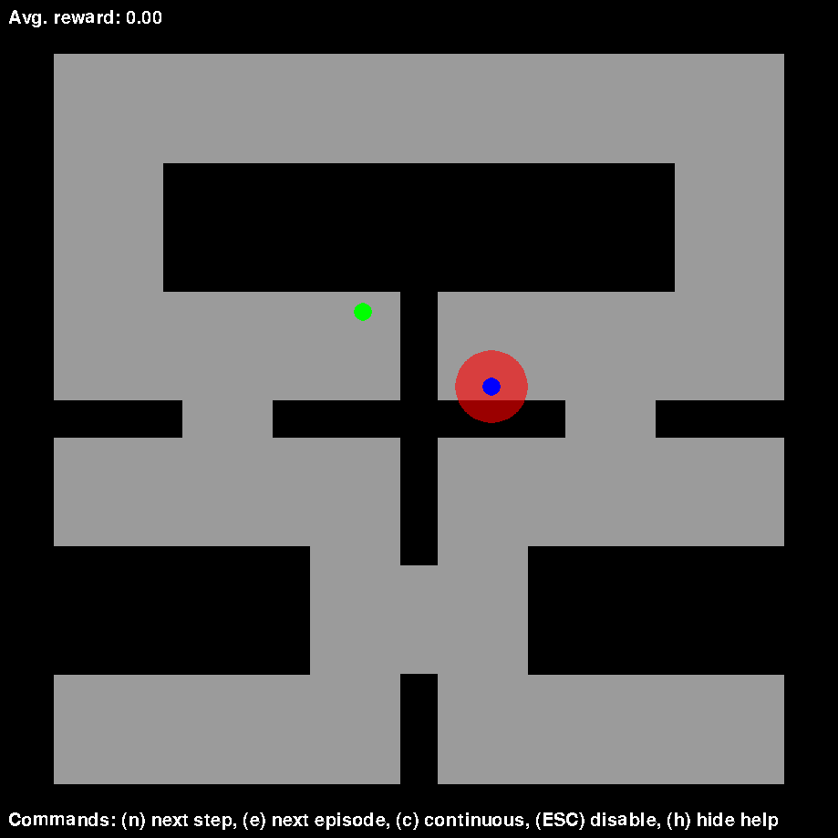
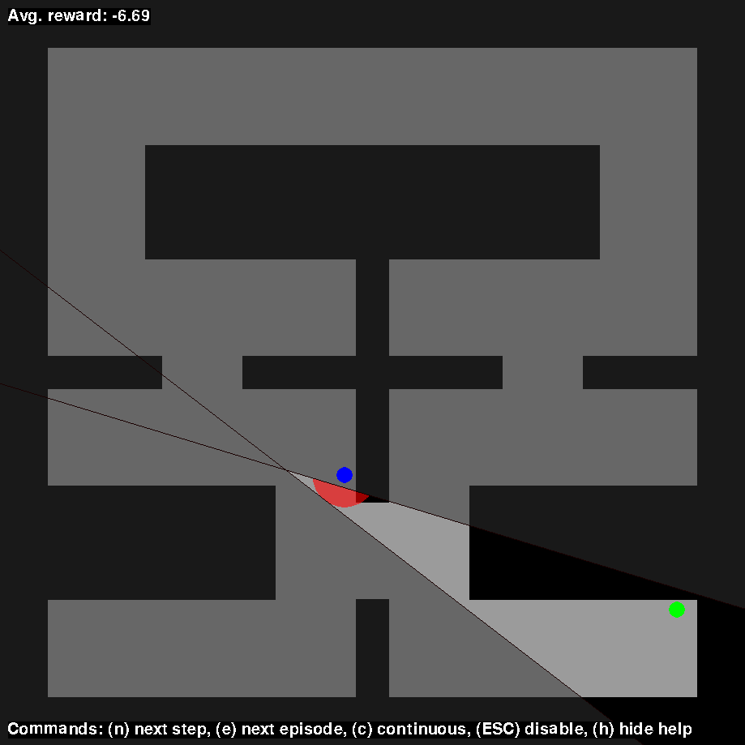

# Constrained Exploration and Recovery from Experience Shaping
Constrained Exploration and Recovery from Experience Shaping is an algorithm for model-free reinforcement learning to actively reshape the action space of an agent during training so that reward-driven exploration is constrained within safety limits.

This repository accompanies the following paper on arXiv: [https://arxiv.org/abs/1809.08925]

| Unconstrained Random Exploration            |  Constrained Random Exploration |
:-------------------------:|:-------------------------:
!  |  !

## Installing

This implementation requires Python 3 and relies on Tensorflow for building and training constraint networks.
Depending on your setup, run:
```
pip install tensorflow-gpu
```
if you have a CUDA-compatible device or:
```
pip install tensorflow
```

For training constraint networks together with control policies, we built on top of the [OpenAI Baselines framework](https://github.com/openai/baselines/).
Install it with:
```
pip install baselines
```
We will maintain compatibility with the OpenAI Baselines ```master``` branch (last confirmed check on 2018-09-08: [commit](https://github.com/openai/baselines/commit/58b1021b28345a902ea20cb99ac0fe3914ee4171)), though feel free to create an [issue](https://github.com/IBM/constrained-rl/issues) if you notice something wrong.

Quadratic program solving is performed using quadprog.
Install first Cython:
```
pip install Cython
```
Then:
```
pip install quadprog
```

Finally, clone this repository and install the local package with pip:
```
git clone git@github.com:IBM/constrained-rl.git
cd constrained-rl
pip install -e .
```

## Examples
Examples and reference data are provided in the [examples] directory:
1. [Learning action space constraints from positive and negative demonstrations](examples/01-constraints-from-demonstrations.md): fixed maze
2. [Learning action space constraints from scratch](examples/02-constraints-from-scratch.md): random obstacles with position and force control

## License <a name="license"></a>
The Constrained Exploration and Recovery from Experience Shaping Project uses the [MIT](LICENSE) software license.

## Contributing to the project
Full details of how to contribute to this project are documented in the [CONTRIBUTING.md](CONTRIBUTING.md) file.

## Maintainers
The project's [maintainers](MAINTAINERS.txt): are responsible for reviewing and merging all pull requests and they guide the over-all technical direction of the project.

