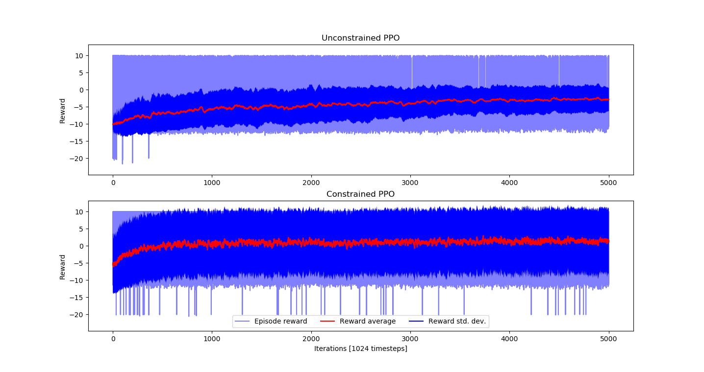
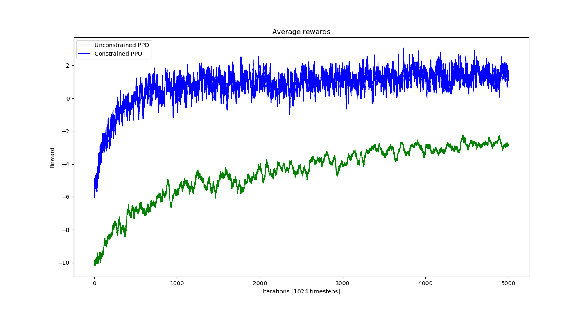

# Guiding exploration with constraints from demonstrations

We consider an environment in which an agent navigates through a fixed maze to reach a target.
The starting position of the agent and the position of the target are randomized at each episode.

Visualize the environment with a random policy:
```
python3 -m ceres.scripts.play_policy --env_id Nav2dPosFixedMazeCeres-v0 \
        --max_episodes 1000 --render
```


Arguments:
* ```--env_id Nav2dPosFixMazeCeres-v0```: environment name (can load environments from modules other than ```ceres``` with the extended argument format ```<module>:<environment name>```)
* ```--max_episodes 1000```: play a random policy for 1000 episodes
* ```--render```: (optional) render to screen

## Learning constraints from demonstrations

500 positive trajectories with negative demonstrations were collected in ```data/Nav2dFixedMaze-500T.npz```

Visualize the demonstrations with:
```
python3 -m ceres.constraints.constraint_demonstration --env_id Nav2dPosFixedMazeCeres-v0 \
        --constraint_demonstration_buffer data/Nav2dFixedMaze-500T.npz --render
```
Possible commands to replay demonstrations within the environment are described in the terminal.

Train a constraint network using the ground truth data with:
```
python3 -m ceres.scripts.train_ceres --env_id Nav2dPosFixedMazeCeres-v0 \
        --constraint_demonstration_buffer data/Nav2dFixedMaze-500T.npz \
        --cnet_n_ineq 2 --cnet_loss pvm:1. --cnet_loss nsm:1. --cnet_loss l2:1e-6 \
        --cnet_spherical_coordinates --cnet_predict_interior_point \
        --cnet_training_epochs 1000 --cnet_decay_epochs 10 --early_stop_positive 0.99 --early_stop_negative 0.99 \
        --max_iter 1 --only_train_constraints --output maze_cnet
```

Arguments:
* ```--constraint_demonstration_buffer data/Nav2dFixedMaze-500T.npz```: use existing demonstration buffer
* ```--cnet_n_ineq 2```: 2 inequality constraints
* ```--cnet_loss pvm:1. --cnet_loss nsm:1. --cnet_loss l2:1e-6```: loss weights for positive violation max, negative satisfaction min, L2 regularization
* ```--cnet_spherical_coordinates```: predict unit-norm constraints using spherical coordinates (alternatively, use ```--cnet_normalize_ineq_mat``` for post-normalization)
* ```--cnet_predict_interior_point```: predict constraints such that there exists an interior point that satisfies them all
* ```--cnet_training_epochs 1000```: train the constraint network over 1000 epochs
* ```--cnet_decay_epochs 10```: halve constraint network learning rate every 10 epochs without loss reduction
* ```--early_stop_positive 0.99 --early_stop_negative 0.99```: interrupt constraint network training if it reaches 99% separation accuracy
* ```--max_iter 1```: run one iteration of CERES training
* ```--only_train_constraints```: only train constraint network within CERES, not policy
* ```--output maze_cnet```: save logs in ```logs/maze_cnet```. If the directory already exists, remove it manually or run the script with ```--overwrite```

The trained constraint network will be saved in ```logs/maze_cnet/worker_0_direct/constraints```.

Visualize the constraints with a random policy:
```
python3 -m ceres.scripts.play_policy --env_id Nav2dPosFixedMazeCeres-v0 \
        --trained_cnet logs/maze_cnet/worker_0_direct/constraints --max_episodes 1000 --render
```


## Baseline PPO

Within CERES, disabling constraints and setting the number of recovery policies to zero amounts to training with PPO:
```
python3 -m ceres.scripts.train_ceres --env_id Nav2dPosFixedMazeCeres-v0 \
        --only_train_policy --constant_constraint_activation 0. --n_recovery 0 \
        --max_iter 5000 --output maze_ppo_unconstrained
```
Arguments:
* ```--only_train_policy```: only train policy, not constraints
* ```--constant_constraint_activation 0.```: set the constraint activation probability to zero throughout training
* ```--n_recovery 0```: do not train recovery agents
* ```--max_iter 5000```: do reinforcement learning for 5000 iterations
* Optionally, run with ```--render``` to visualize exploration and constraints.

The trained policy will be saved in ```logs/maze_ppo_unconstrained/worker_0_direct/policy```

## Applying constraints to guide PPO

Apply the trained constraint network to restrict the exploration range:
```
python3 -m ceres.scripts.train_ceres --env_id Nav2dPosFixedMazeCeres-v0 \
        --only_train_policy --constant_constraint_activation 1. --n_recovery 0 \
        --trained_cnet logs/maze_cnet/worker_0_direct/constraints \
        --max_iter 5000 --output maze_ppo_constrained
```
Arguments:
* ```--constant_constraint_activation 1.```: always enable constraints
* ```--trained_cnet logs/maze_cnet/worker_0_direct/constraints```: use the constraint network trained previously

The trained policy will be saved in ```logs/maze_ppo_constrained/worker_0_direct/policy```

## Compare rewards with and without constraints

Plot the rewards during training:
```
python3 -m ceres.scripts.plot_rewards \
        --plot_path "Unconstrained PPO=logs/maze_ppo_unconstrained/worker_0_direct" \
        --plot_path "Constrained PPO=logs/maze_ppo_constrained/worker_0_direct"
```



