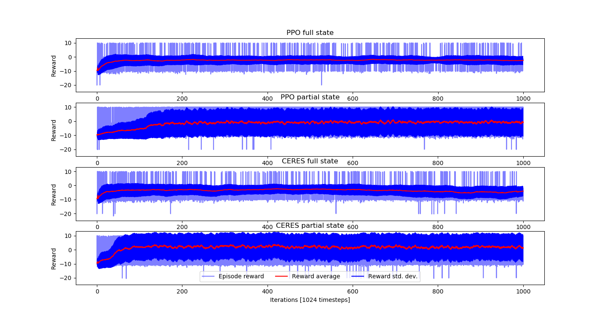
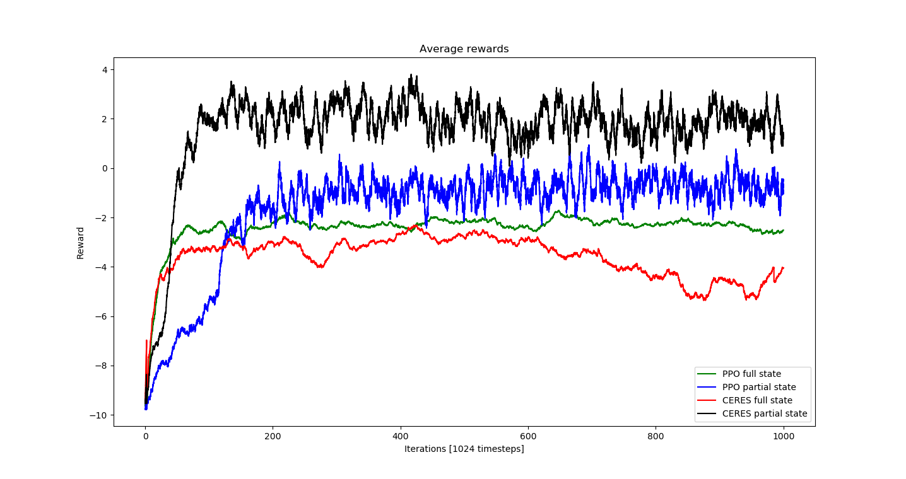

# Training policy and constraints from scratch

We consider an environment in which an agent navigates through random obstacles to reach a target by position commands.
The starting position of the agent, the position of the target, the obstacle positions and sizes are randomized at each episode.

Visualize the environment with a random policy:
```
python3 -m ceres.scripts.play_policy --env_id Nav2dPosRandomHolesCeres-v0 \
        --max_episodes 1000 --render
```


Arguments:
* ```--env_id Nav2dPosRandomHolesCeres-v0```: environment name (can load environments from modules other than ```ceres``` with the extended argument format ```<module>:<environment name>```)
* ```--max_episodes 1000```: play a random policy for 1000 episodes
* ```--render```: (optional) render to screen

## Baseline PPO

Within CERES, disabling constraints and setting the number of recovery policies to zero amounts to training with PPO:
```
python3 -m ceres.scripts.train_ceres --env_id Nav2dPosRandomHolesCeres-v0 \
        --only_train_policy --constant_constraint_activation 0. --n_recovery 0 \
        --max_iter 1000 --output random_pos_ppo_full
```
Arguments:
* ```--only_train_policy```: only train policy, not constraints
* ```--constant_constraint_activation 0.```: set the constraint activation probability to zero throughout training
* ```--n_recovery 0```: do not train recovery agents
* ```--max_iter 1000```: do reinforcement learning for 1000 iterations
* ```--output random_pos_ppo_full```: save logs in ```logs/random_pos_ppo_full```. If the directory already exists, remove it manually or run the script with ```--overwrite```
* Optionally, run with ```--render``` to visualize exploration and constraints.

Optionally, we can train the control policy using only a selection of available observations:
```
python3 -m ceres.scripts.train_ceres --env_id Nav2dPosRandomHolesCeres-v0 \
        --only_train_policy --constant_constraint_activation 0. --n_recovery 0 \
        --policy_observation_filter 0:1:2:3 --max_iter 1000 --output random_pos_ppo_partial
```
Argument:
* ```--policy_observation_filter 0:1:2:3```: only provide the policy with state elements 0, 1, 2 and 3 (agent and target 2D locations), not 4 and up (distances to surrounding obstacles)

## Learning constraints through exploration and recovery

Train direct and recovery policies with CERES:
```
python3 -m ceres.scripts.train_ceres --env_id Nav2dPosRandomHolesCeres-v0 \
        --cnet_n_ineq 4 --cnet_loss pvm:1. --cnet_loss nsm:1. --cnet_loss l2:1e-6 \
        --cnet_spherical_coordinates --cnet_predict_interior_point --unconstrained_recovery \
        --adaptive_constraint_activation prior_min --interrupt_constraint_training prior_accuracy:0.95:5:0.90:1 \
        --max_iter 1000 --output random_pos_ceres_full
```

Arguments:
* ```--cnet_n_ineq 4```: 4 inequality constraints
* ```--cnet_loss pvm:1. --cnet_loss nsm:1. --cnet_loss l2:1e-6```: loss weights for positive violation max, negative satisfaction min, L2 regularization
* ```--cnet_spherical_coordinates```: predict unit-norm constraints using spherical coordinates (alternatively, use ```--cnet_normalize_ineq_mat``` for post-normalization)
* ```--cnet_predict_interior_point```: predict constraints such that there exists an interior point that satisfies them all
* ```--unconstrained_recovery```: only apply constraints to the direct agent, not recovery
* ```--adaptive_constraint_activation prior_min```: adjust the constraint activation probability based on their accuracy at this iteration before training
* ```--interrupt_constraint_training prior_accuracy:0.95:5:0.90:1```: stop training constraints if their accuracy before training (prior_accuracy) exceeds 95% (0.95) for at least 5 iterations (5). Re-enable training if constraint accuracy falls below 90% (0.90) for at least 1 iteration (1)
* If omitted, the ```--n_recovery``` argument is set to be equal to the number of direct agents ```--n_direct``` (1 by default)

Similarly to the baseline PPO, we can train the policy from agent and target positions only and let the constraint network deal with obstacle avoidance:
```
python3 -m ceres.scripts.train_ceres --env_id Nav2dPosRandomHolesCeres-v0 \
        --cnet_n_ineq 4 --cnet_loss pvm:1. --cnet_loss nsm:1. --cnet_loss l2:1e-6 \
        --cnet_spherical_coordinates --cnet_predict_interior_point --unconstrained_recovery \
        --adaptive_constraint_activation prior_min --interrupt_constraint_training prior_accuracy:0.95:5:0.90:1 \
        --policy_observation_filter 0:1:2:3 --max_iter 1000 --output random_pos_ceres_partial
```

## Compare rewards with and without constrained exploration

Plot the rewards during training:
```
python3 -m ceres.scripts.plot_rewards \
        --plot_path "PPO full state=logs/random_pos_ppo_full/worker_0_direct" \
        --plot_path "PPO partial state=logs/random_pos_ppo_partial/worker_0_direct" \
        --plot_path "CERES full state=logs/random_pos_ceres_full/worker_0_direct" \
        --plot_path "CERES partial state=logs/random_pos_ceres_partial/worker_0_direct"
```


## Random obstacles with force control

We can apply the same method to the case where the agent is controlled with force commands.

Visualize the environment with a random policy:
```
python3 -m ceres.scripts.play_policy --env_id Nav2dForceRandomHolesCeres-v0 \
        --max_episodes 1000 --render
```


Baseline PPO from full state:
```
python3 -m ceres.scripts.train_ceres --env_id Nav2dForceRandomHolesCeres-v0 \
        --only_train_policy --constant_constraint_activation 0. --n_recovery 0 \
        --max_iter 1000 --output random_force_ppo_full
```

Baseline PPO from filtered state (0 to 5: agent position and velocity, target position):
```
python3 -m ceres.scripts.train_ceres --env_id Nav2dForceRandomHolesCeres-v0 \
        --only_train_policy --constant_constraint_activation 0. --n_recovery 0 \
        --policy_observation_filter 0:1:2:3:4:5 --max_iter 1000 --output random_force_ppo_partial
```

CERES from full state:
```
python3 -m ceres.scripts.train_ceres --env_id Nav2dForceRandomHolesCeres-v0 \
        --cnet_n_ineq 4 --cnet_loss pvm:1. --cnet_loss nsm:1. --cnet_loss l2:1e-6 \
        --cnet_spherical_coordinates --cnet_predict_interior_point --unconstrained_recovery \
        --adaptive_constraint_activation prior_min --interrupt_constraint_training prior_accuracy:0.95:5:0.90:1 \
        --max_iter 1000 --output random_force_ceres_full
```

CERES from filtered state:
```
python3 -m ceres.scripts.train_ceres --env_id Nav2dForceRandomHolesCeres-v0 \
        --cnet_n_ineq 4 --cnet_loss pvm:1. --cnet_loss nsm:1. --cnet_loss l2:1e-6 \
        --cnet_spherical_coordinates --cnet_predict_interior_point --unconstrained_recovery \
        --adaptive_constraint_activation prior_min --interrupt_constraint_training prior_accuracy:0.95:5:0.90:1 \
        --policy_observation_filter 0:1:2:3:4:5 --max_iter 1000 --output random_force_ceres_partial
```

Plot the rewards during training:
```
python3 -m ceres.scripts.plot_rewards \
        --plot_path "PPO full state=logs/random_force_ppo_full/worker_0_direct" \
        --plot_path "PPO partial state=logs/random_force_ppo_partial/worker_0_direct" \
        --plot_path "CERES full state=logs/random_force_ceres_full/worker_0_direct" \
        --plot_path "CERES partial state=logs/random_force_ceres_partial/worker_0_direct"
```



